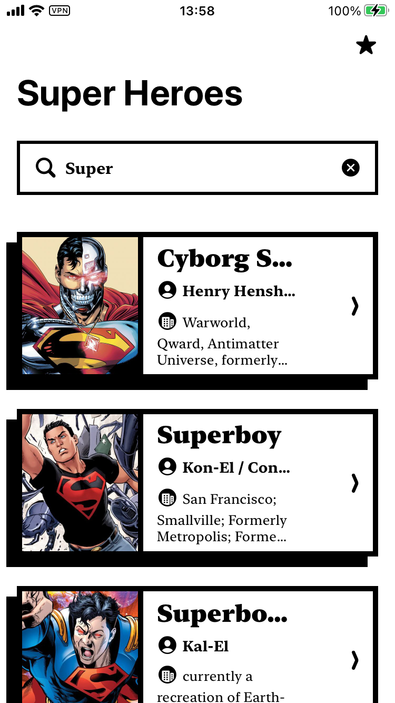
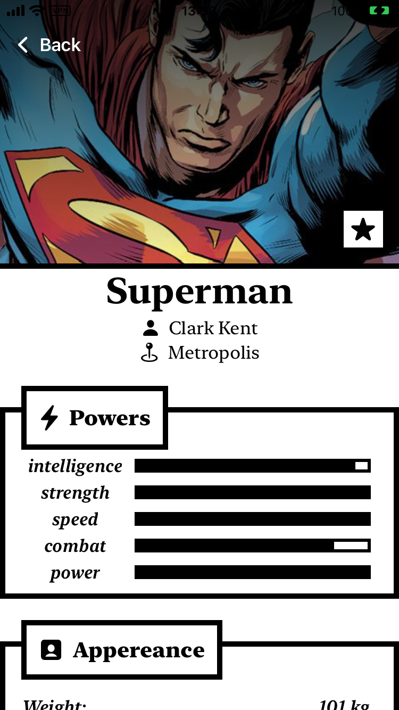
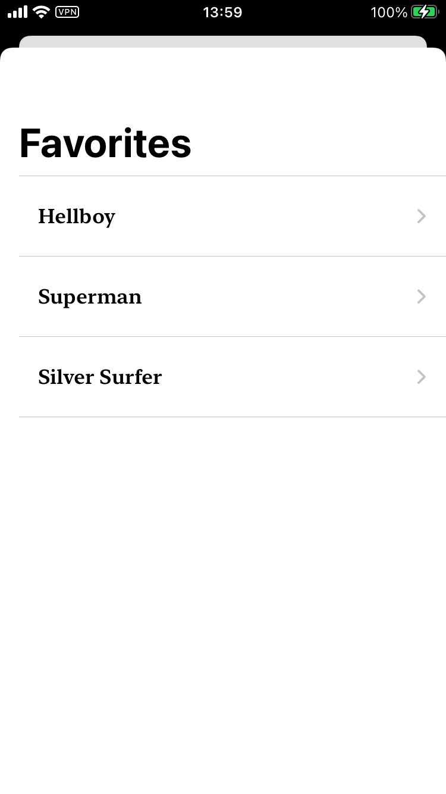
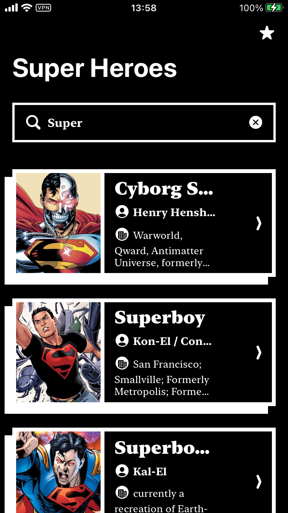
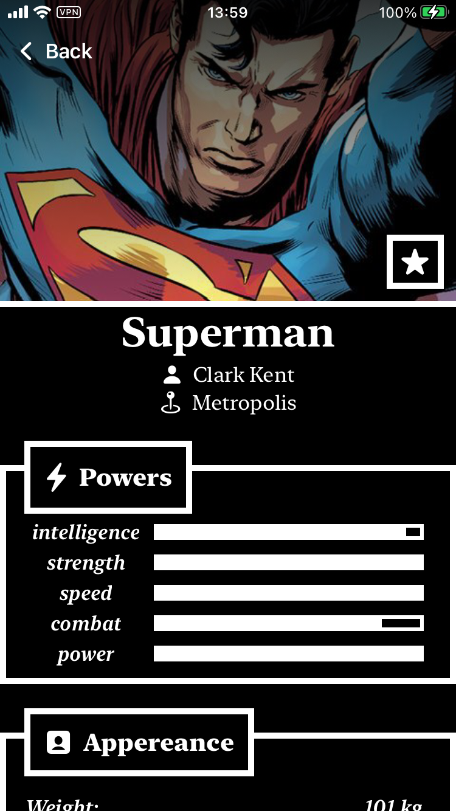
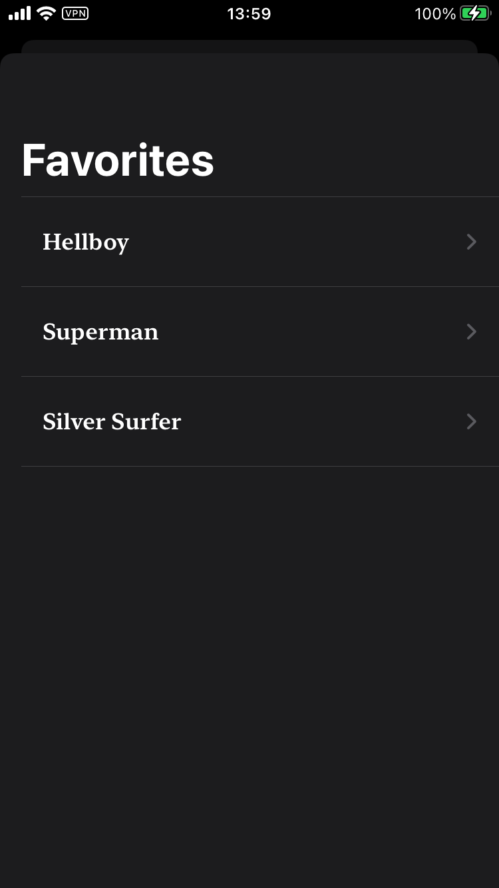

# SuperHeroesUI
Super simple iOS app for searching through superheroes and saving your favorite ones. It's a personal project that I developed to get more familiar with `SwiftUI`, `Combine` and `MVVM architecture`. It uses [SuperHero API]("https://superheroapi.com/") for fetching and searching superheroes and uses `USerDefaults` for storing superheroes that user picked up as favorite.

<table>
    <tr>
        <td></td>
        <td></td>
        <td></td>
    </tr>
    <tr>
        <td></td>
        <td></td>
        <td></td>
    </tr>

</table>